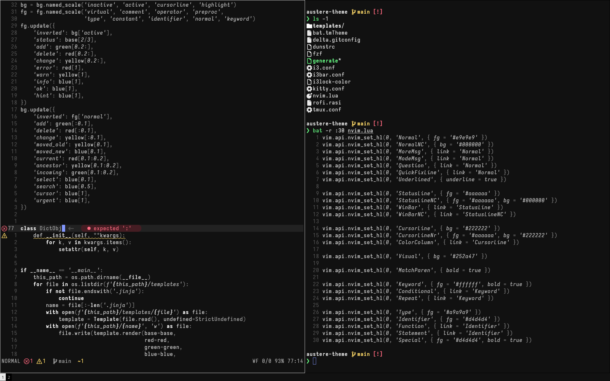

# Austere theme

A simple, mostly grayscale theme.

> [!WARNING]
> Under development. The exact palette is subject to change.

Available for:
* bat and other `.tmTheme`-based software (only bat was tested)
* delta
* Dunst
* fzf
* i3, i3bar, i3lock-color
* kitty
* Neovim (see [austere-theme.nvim](https://github.com/kbieganski/austere-theme.nvim))
* Rofi
* tmux
